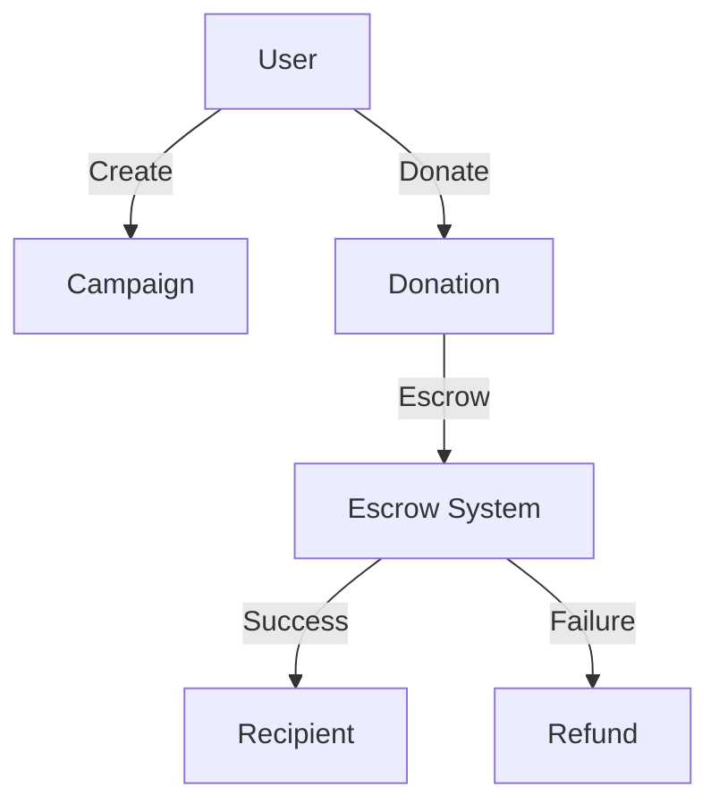
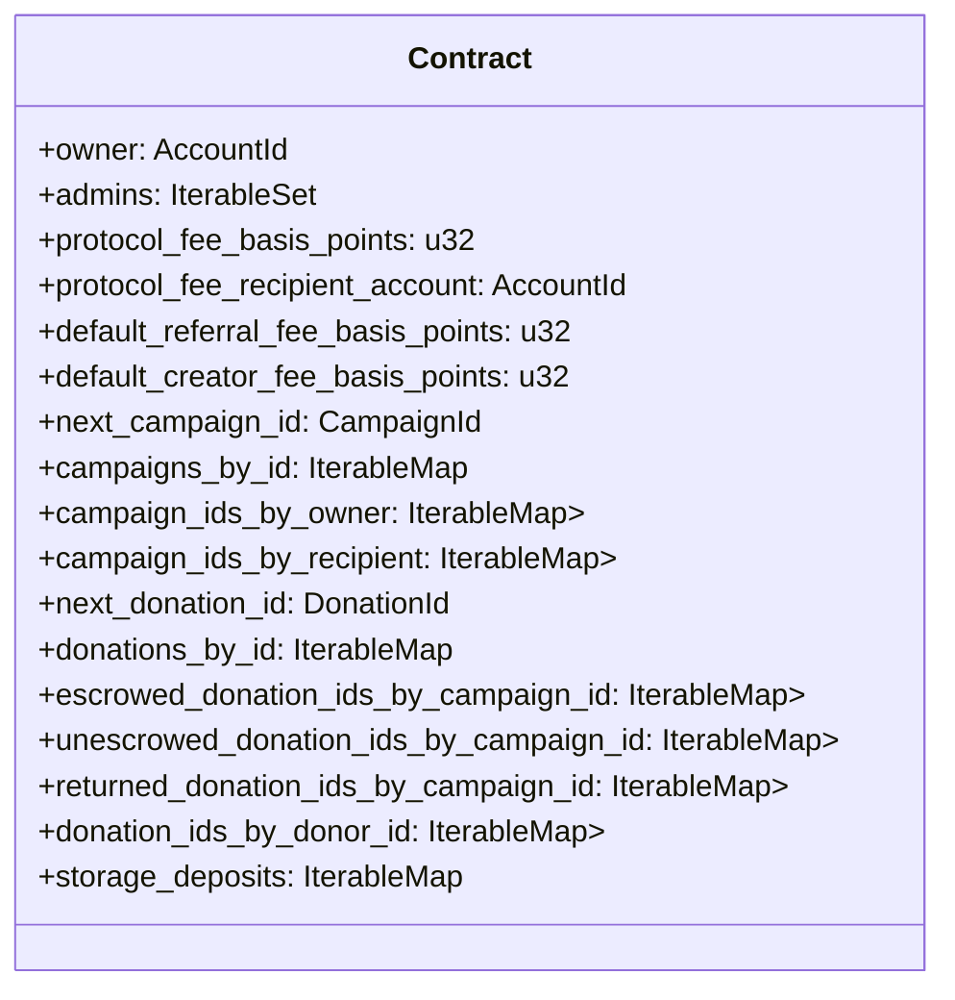
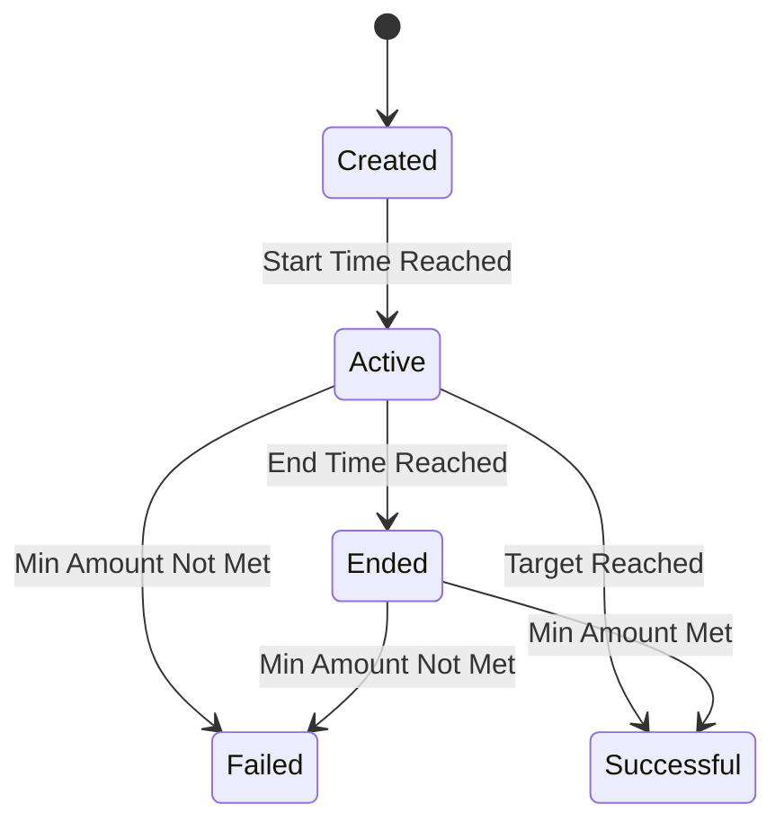
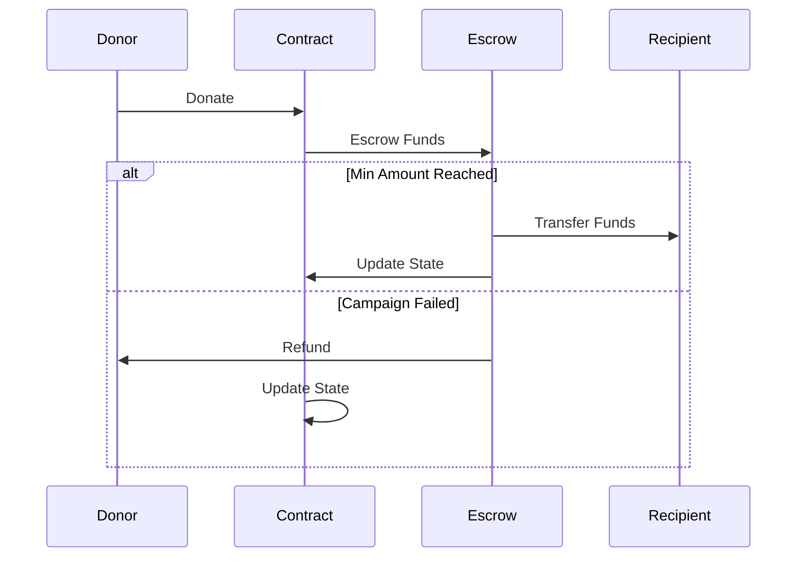

# NEAR Campaigns Contract

A decentralized crowdfunding platform built on the NEAR Protocol that enables users to create campaigns, donate to them, and manage funds through an escrow system.

## Table of Contents
1. [Overview](#overview)
2. [Purpose](#purpose)
3. [Architecture](#architecture)
4. [Core Components](#core-components)
5. [State Management](#state-management)
6. [Operations](#operations)
7. [Security Considerations](#security-considerations)
8. [Error Handling](#error-handling)
9. [Events](#events)
10. [Contract Methods](#contract-methods)

## Overview

The NEAR Campaigns Contract provides a way to raise funds, either for yourself as an organization or on behalf of an organization, through donations. Campaigns can function as an escrow with minimum target amounts, refunding donors if the target is not met. Campaigns can be time-based and support both native NEAR and fungible token donations.



## Purpose

The typical flow / lifetime of a campaign is as follows:

- Campaign is **created** via Campaign contract's `create_campaign` function call
  - Creator (e.g. user that calls `create_campaign` on contract) is, by default, the "owner" of the campaign
- After creation, some Campaign details can be updated by owner
- A **recipient** account will be set during campaign creation, it defines who/what the campaign is for
- During the **campaign** (between `campaign.start_ms` and `campaign.end_ms`), end users may donate to the campaign
- Donations are either held in escrow (until minimum target is reached) or transferred to the recipient
- Once the campaign is over, donations are processed in batch, sent to recipient and fees sent to the appropriate channels

## Architecture

### Contract Structure



### General Types

```rust
type CampaignId = u64;
type DonationId = u64;
type TimestampMs = u64;
type ReferrerPayouts = HashMap<AccountId, Balance>;
```

## Core Components

### Campaign

```rust
pub struct Campaign {
    pub owner: AccountId,
    pub name: String,
    pub description: Option<String>,
    pub cover_image_url: Option<String>,
    pub recipient: AccountId,
    pub start_ms: TimestampMs,
    pub end_ms: Option<TimestampMs>,
    pub created_ms: TimestampMs,
    pub ft_id: Option<AccountId>,
    pub target_amount: Balance,
    pub min_amount: Option<Balance>,
    pub max_amount: Option<Balance>,
    pub total_raised_amount: Balance,
    pub net_raised_amount: Balance,
    pub escrow_balance: Balance,
    pub referral_fee_basis_points: u32,
    pub creator_fee_basis_points: u32,
    pub allow_fee_avoidance: bool,
}
```

### Donation

```rust
pub struct Donation {
    pub id: DonationId,
    pub campaign_id: CampaignId,
    pub donor_id: AccountId,
    pub total_amount: u128,
    pub net_amount: u128,
    pub message: Option<String>,
    pub donated_at_ms: TimestampMs,
    pub protocol_fee: u128,
    pub referrer_id: Option<AccountId>,
    pub referrer_fee: Option<u128>,
    pub creator_fee: u128,
    pub returned_at_ms: Option<TimestampMs>,
}
```

## State Management

### Campaign Lifecycle



### Donation Flow



## Operations

### Campaign Management

1. **Create Campaign**
   - Input validation
   - State initialization
   - Storage setup
   - Event emission

2. **Update Campaign**
   - Owner validation
   - Parameter validation
   - State updates
   - Event emission

3. **Delete Campaign**
   - Preconditions check
   - State cleanup
   - Storage cleanup
   - Event emission

### Donation Management

1. **Make Donation**
   - Campaign validation
   - Fee calculation
   - State updates
   - Escrow management
   - Event emission

2. **Process Escrowed Donations**
   - Batch processing
   - Transfer execution
   - Fee distribution
   - State updates
   - Event emission

3. **Process Refunds**
   - Batch processing
   - Refund calculation
   - Transfer execution
   - State updates
   - Event emission

## Security Considerations

### Access Control
- Owner-only operations
- Admin privileges
- Campaign owner rights
- Donor permissions

### Fee Management
- Protocol fees
- Creator fees
- Referral fees
- Fee avoidance controls

### Storage Management
- Storage deposits
- Storage refunds
- Storage optimization

## Error Handling

### Error Types
1. **Validation Errors**
   - Invalid parameters
   - Invalid state
   - Invalid timing

2. **Permission Errors**
   - Unauthorized access
   - Invalid permissions
   - Role violations

3. **Transfer Errors**
   - Failed transfers
   - Insufficient funds
   - Gas errors

4. **State Errors**
   - Invalid state transitions
   - State conflicts
   - State corruption

## Events

### Event Types
1. **Campaign Events**
   - CampaignCreated
   - CampaignUpdated
   - CampaignDeleted
   - CampaignEnded

2. **Donation Events**
   - DonationReceived
   - DonationProcessed
   - DonationRefunded
   - DonationFailed

3. **Fee Events**
   - FeeCollected
   - FeeDistributed
   - FeeRefunded

4. **System Events**
   - StorageDeposited
   - StorageRefunded
   - StateUpdated

## Contract Methods

### Write Methods

**NB: ALL privileged write methods (those beginning with `admin_*` or `owner_*`) require an attached deposit of at least one yoctoNEAR, for security purposes.**

```rust
// INIT
pub fn new(
    owner: AccountId,
    protocol_fee_basis_points: u32,
    protocol_fee_recipient_account: AccountId,
    default_referral_fee_basis_points: u32,
    default_creator_fee_basis_points: u32,
    source_metadata: ContractSourceMetadata,
) -> Self

// Campaign
#[payable]
pub fn create_campaign(
    &mut self,
    name: String,
    description: Option<String>,
    cover_image_url: Option<String>,
    recipient: AccountId,
    start_ms: TimestampMs,
    end_ms: Option<TimestampMs>,
    ft_id: Option<AccountId>,
    target_amount: U128,
    min_amount: Option<U128>,
    max_amount: Option<U128>,
    referral_fee_basis_points: Option<u32>,
    creator_fee_basis_points: Option<u32>,
    allow_fee_avoidance: Option<bool>,
) -> CampaignExternal

#[payable]
pub fn update_campaign(
    &mut self,
    campaign_id: CampaignId,
    name: Option<String>,
    description: Option<String>,
    cover_image_url: Option<String>,
    start_ms: Option<TimestampMs>,
    end_ms: Option<TimestampMs>,
    ft_id: Option<AccountId>,
    target_amount: Option<Balance>,
    max_amount: Option<Balance>,
    min_amount: Option<U128>,
    allow_fee_avoidance: Option<bool>,
) -> CampaignExternal

pub fn delete_campaign(&mut self, campaign_id: CampaignId)

// Donation
#[payable]
pub fn donate(
    &mut self,
    campaign_id: CampaignId,
    message: Option<String>,
    referrer_id: Option<AccountId>,
    bypass_protocol_fee: Option<bool>,
    bypass_creator_fee: Option<bool>,
) -> PromiseOrValue<DonationExternal>

// Storage
pub fn storage_deposit(&mut self) -> U128
pub fn storage_withdraw(&mut self, amount: Option<U128>) -> U128

// Owner
#[payable]
pub fn owner_change_owner(&mut self, owner: AccountId)
pub fn owner_add_admins(&mut self, admins: Vec<AccountId>)
pub fn owner_remove_admins(&mut self, admins: Vec<AccountId>)
pub fn owner_clear_admins(&mut self)

// Source Metadata
pub fn self_set_source_metadata(&mut self, source_metadata: ContractSourceMetadata)
```

### Read Methods

```rust
// Config
pub fn get_config(&self) -> Config

// Campaigns
pub fn get_campaign(&self, campaign_id: CampaignId) -> CampaignExternal
pub fn get_campaigns(&self, from_index: Option<u128>, limit: Option<u128>) -> Vec<CampaignExternal>
pub fn get_campaigns_by_owner(&self, owner_id: AccountId, from_index: Option<u128>, limit: Option<u128>) -> Vec<CampaignExternal>
pub fn get_campaigns_by_recipient(&self, recipient_id: AccountId, from_index: Option<u128>, limit: Option<u128>) -> Vec<CampaignExternal>

// Donations
pub fn get_donations(&self, from_index: Option<u128>, limit: Option<u64>) -> Vec<DonationExternal>
pub fn get_donation_by_id(&self, donation_id: DonationId) -> Option<DonationExternal>
pub fn get_donations_for_campaign(&self, campaign_id: CampaignId, from_index: Option<u128>, limit: Option<u64>) -> Vec<DonationExternal>
```
